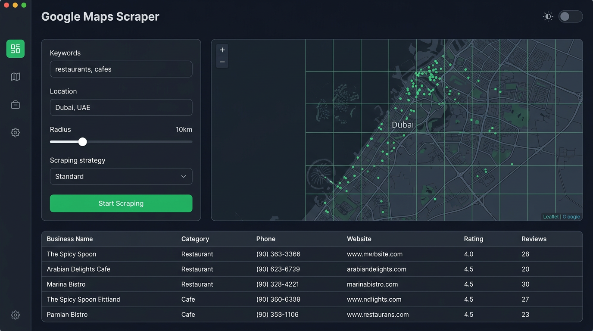

<div align="center">

# Google Maps Scraper

**Extract business leads from Google Maps — right from your desktop.**

A cross-platform Electron app that scrapes Google Maps for business data using adaptive grid search, website enrichment, proxy rotation, and anti-detection resilience.

[](https://github.com/userisaziz/gscrapper/releases)
[](https://github.com/userisaziz/gscrapper/releases)
[](#)

[Download](https://gscrapper.vercel.app) · [Features](#features) · [How It Works](#how-it-works) · [Lead Data](#what-you-get-per-lead) · [Getting Started](#getting-started) · [Installation Help](#installation-troubleshooting)

</div>

---

<div align="center">



</div>

---

## How It Works

1. **Set your target** — Enter business keywords (e.g. "restaurants", "dentists"), pick a location on the interactive map, and set the search radius.
2. **Choose a strategy** — Pick from Quick, Standard, Detailed, or Deep presets that control zoom level, scroll depth, and pacing. Optionally enable website enrichment and proxy rotation.
3. **Start scraping** — The engine divides the area into an adaptive geographic grid, scanning each cell to bypass Google's ~100 results-per-search limit. Dense areas are automatically subdivided for full coverage.
4. **Enrich leads** — With enrichment enabled, a real browser visits each business's website to extract emails, phone numbers, social media links, and descriptions.
5. **Export to CSV** — Results stream to disk in real time as they're discovered. Open the CSV in Excel, Sheets, or your CRM.

---

## What You Get Per Lead

Each scraped business includes 30+ data points:

| Data | Details |
|------|---------|
| Business Info | Name, category, description, status, price range |
| Contact | Phone, website, emails (from website), additional phones |
| Location | Full address, lat/lng, plus code, timezone, street view URL |
| Social & Web | Social media profiles, website description, key people |
| Ratings | Overall rating, review count, per-rating breakdown, sub-ratings |
| Reviews | Full review text, author, date, rating, images, owner replies |
| Hours | Opening hours per day, popular times heatmap |
| Media | Photos, thumbnails, menu links, reservation & ordering links |
| Metadata | Google Maps link, place ID, CID, owner info, credits cards accepted |

---

## Features

### Scraping Engine

| Feature | Description |
|---------|-------------|
| Adaptive Grid Search | Divides the target radius into geographic cells, subdividing dense areas automatically to capture results beyond Google's ~100-per-search limit |
| Search Strategy Presets | One-click profiles — Quick, Standard, Detailed, Deep — that tune zoom, scroll depth, and speed |
| Website Enrichment | Visits each lead's website with a real browser to extract emails, phone numbers, social media links, descriptions, and key people |
| Review Extraction | RPC-based pagination via Google's batchexecute endpoint with DOM scraping fallback, plus date-range filtering |
| Real-time CSV Export | Results stream to disk as they're found — no waiting for the full job to finish |
| Job Management | Persistent job history with status tracking, cancellation, and resume |

### Resilience & Anti-Detection

| Feature | Description |
|---------|-------------|
| Proxy Rotation | Health-checks proxies upfront, rotates through healthy ones with randomized pacing |
| User-Agent Rotation | Cycles through a pool of realistic browser fingerprints per context |
| Block Detection & Cooldown | Detects CAPTCHA / consent walls and enters a configurable cooldown before retrying |
| Browser Crash Recovery | Automatically relaunches Chromium on fatal crashes mid-job |

### Desktop App

| Feature | Description |
|---------|-------------|
| Cross-Platform | Windows (x64), macOS (Intel + Apple Silicon), Linux (AppImage) |
| Interactive Map | Pick search center and visualize coverage with Leaflet |
| Dark / Light Theme | System-aware theme toggle |
| Auto-Update | Built-in updater checks for new releases |
| License System | Hardware-bound license activation with offline grace period |

---

## Tech Stack

| Layer | Technology |
|-------|------------|
| Desktop Shell | Electron 33 |
| Frontend | React 18, Vite 6, Tailwind CSS 4, Radix UI, TanStack Query |
| Scraping | Playwright (headless Chromium) |
| Data Parsing | Cheerio, Zod validation |
| Storage | better-sqlite3 (local job/review store) |
| Auth / Licensing | Supabase (auth + edge functions) |
| Map UI | Leaflet + react-leaflet |
| Testing | Vitest |

---

## Getting Started

### Prerequisites

- **Node.js** 20+
- **npm**

### Development

```bash
cd app
npm install
npm run dev
```

This compiles the main/preload processes, starts the Vite dev server, and launches Electron with hot reload.

### Build

```bash
npm run build:mac     # macOS (Intel + ARM)
npm run build:win     # Windows x64
npm run build:linux   # Linux AppImage
```

Build artifacts land in `app/release/`.

### Test

```bash
npm run test          # run all tests
npm run test:watch    # watch mode
npm run test:coverage # with coverage report
```

---

## Project Structure

```
├── app/                        Electron desktop application
│   ├── src/
│   │   ├── main/              Main process
│   │   │   ├── scraper/       Scraping engine, grid, proxy, resilience, enrichment
│   │   │   ├── store/         SQLite persistence (jobs, reviews)
│   │   │   ├── license/       Hardware-bound license management
│   │   │   ├── ipc.ts         IPC handlers (renderer ↔ main)
│   │   │   └── updater.ts     Auto-update logic
│   │   ├── preload/           Context bridge
│   │   └── renderer/          React UI (views, components, hooks)
│   └── scripts/               Build helpers (browser bundling, config injection)
├── website/                   Download landing page (Vercel + GitHub Pages)
├── assets/                    README images
└── .github/workflows/         CI/CD (deploy website on push to main)
```

---

## Website

Static download page with automatic OS detection. Live at [gscrapper.vercel.app](https://gscrapper.vercel.app) (also mirrored on GitHub Pages).

No build step — open `website/index.html` locally to preview.

---

## Releases

Binaries are published as [GitHub Releases](https://github.com/userisaziz/gscrapper/releases). The download page auto-detects the visitor's OS and links to the appropriate asset.

| Platform | Asset |
|----------|-------|
| Windows x64 | `Google-Maps-Scraper-Setup-x.x.x.exe` |
| macOS Apple Silicon | `Google-Maps-Scraper-x.x.x-arm64.dmg` |
| macOS Intel | `Google-Maps-Scraper-x.x.x.dmg` |
| Linux x64 | `Google-Maps-Scraper-x.x.x.AppImage` |

---

## Installation Troubleshooting

The app is not code-signed or notarized, so your operating system may show a security warning on first launch. This is normal for open-source apps distributed outside official app stores.

### macOS — "Apple could not verify…"

> "Apple could not verify 'Google Maps Scraper' is free of malware that may harm your Mac or compromise your privacy."

1. Open the `.dmg` and drag the app to **Applications**.
2. When the warning appears, click **Cancel** (do *not* move to Trash).
3. Open **System Settings → Privacy & Security**.
4. Scroll down — you'll see a message: *"Google Maps Scraper was blocked…"*. Click **"Open Anyway"**.
5. Click **Open** in the confirmation dialog.

The warning only appears once. Subsequent launches work normally.

**Alternative (Terminal)** — after dragging the app to Applications:

```bash
xattr -cr /Applications/Google\ Maps\ Scraper.app
```

> If the app is still in Downloads: `xattr -cr ~/Downloads/Google\ Maps\ Scraper.app`

### Windows — "Windows protected your PC"

> "Microsoft Defender SmartScreen prevented an unrecognized app from starting."

1. Run the `.exe` installer.
2. When the SmartScreen dialog appears, click **"More info"**.
3. Click **"Run anyway"** at the bottom of the dialog.
4. Proceed with installation as normal.

### Linux — AppImage won't launch

1. Make the file executable:
   ```bash
   chmod +x Google-Maps-Scraper-*.AppImage
   ```
2. Run it:
   ```bash
   ./Google-Maps-Scraper-*.AppImage
   ```
3. If your file manager blocks it, right-click → **Properties** → **Permissions** → check **"Allow executing file as program"**.

---

<div align="center">

**Built with Electron + Playwright + React**

</div>
